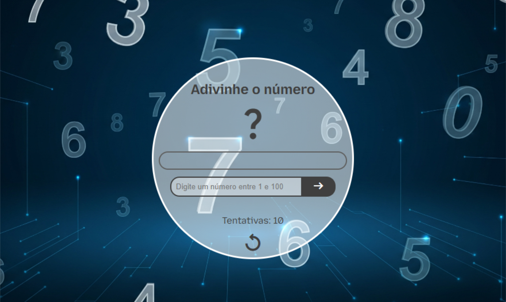

# 🎮 adivinhe-o-numero
Minha implementação do jogo de adivinhação de números mostrado na seção "um primeiro mergulho javascript" da mdn.

---

## 📜 Descrição
Este é um jogo simples e divertido, onde você deve adivinhar um número secreto gerado aleatoriamente entre 1 e 100. A cada tentativa, o jogo te dá uma dica, dizendo se o número que você chutou é maior ou menor que o número secreto. Você tem 10 chances para acertar e se divertir!

---

## 🖼️ Preview



---

## 💻 Tecnologias utilizadas
- HTML: Para a estrutura e marcação da página.

- CSS: Para a estilização e responsividade, incluindo o design do layout e os efeitos visuais.

- JavaScript: Para a lógica do jogo, validação de entrada, gerenciamento de chances e interação com o DOM.

---

## 📂 Estrutura de Arquivos

```
/adivinhe-o-numero
├── src/
│   ├── css/
│   │   └── style.css
│   ├── images/
│   │   ├── background.png
│   │   ├── favicon.png
│   │   └── preview.png
│   └── script/
│       └── script.js
├── .gitignore
├── index.html
└── README.md
```

---

## 🌐 Como Acessar o Projeto

Você pode acessar o projeto de duas formas:

1) Através do GitHub Pages:
Clique no link para jogar diretamente no seu navegador: https://charlesson-mp.github.io/adivinhe-o-numero/

2) Através do Repositório GitHub:
Você pode clonar o repositório para a sua máquina e executá-lo localmente: https://github.com/Charlesson-MP/adivinhe-o-numero